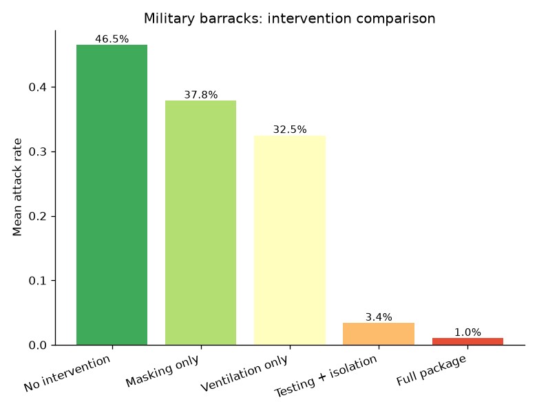
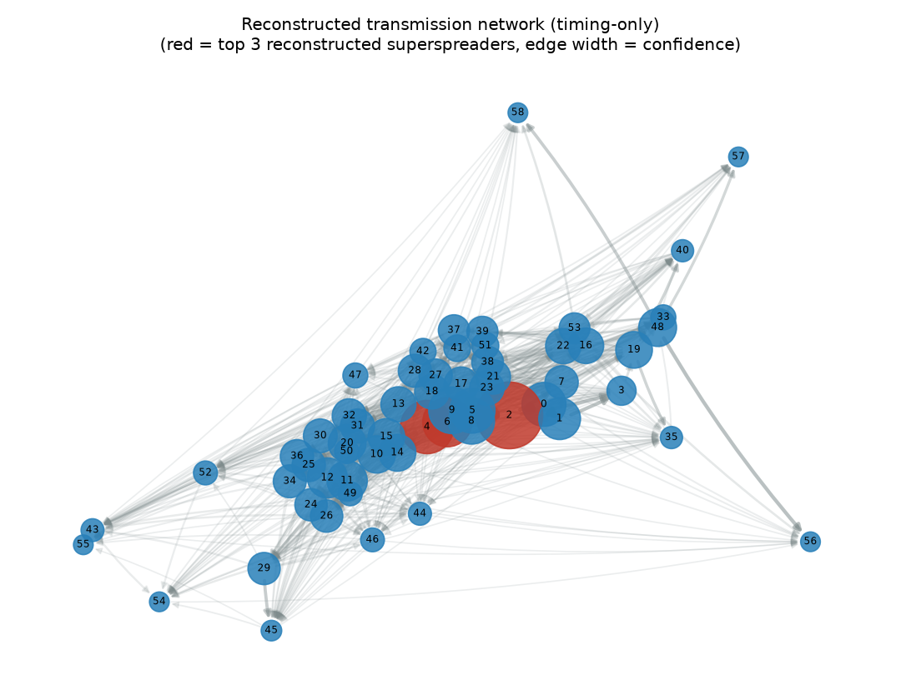
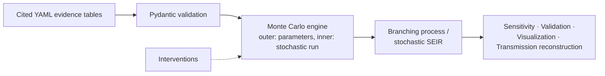

# Monte Carlo Infectious Disease Outbreak Simulator

A Monte Carlo simulation framework for estimating transmission risk,
quantifying uncertainty, evaluating interventions, and reconstructing
transmission chains for closed-setting outbreaks (choirs, barracks,
dormitories, schools) — built around real, cited literature parameters and
a stochastic branching-process model with explicit superspreading support.

```markdown
## Example output




```

```python
from outbreak_simulator.simulations import run_scenario, print_summary

result = run_scenario("choir_rehearsal", n_iterations=5000, seed=20260720)
print(print_summary(result))
```

```
Scenario: Indoor choir rehearsal (superspreading event)  (pathogen: SARS-CoV-2 (ancestral / wild-type strain, 2020 baseline))
Intervention stack: No intervention (baseline)
Attack rate  -- mean 33.1%, median 1.6%, 95% UI [1.6%, 100.0%]
Extinction probability: 68.6%
Observed real-world benchmark(s):
  - Skagit Valley Chorale rehearsal, Mount Vernon, WA, March 10 2020: attack rate 86.0% (Hamner et al. 2020, MMWR 69(19):606-610)
```

## Why this exists

Most outbreak-modeling code either (a) hardcodes parameters with no
citation trail, or (b) uses a mean-field compartmental model that averages
away the superspreading dynamics that actually drove events like the
Skagit choir outbreak. This project does neither: every parameter is
sourced in `data/parameters/pathogens.yaml` with an explicit evidence-
quality tag, and the primary model is an individual-level stochastic
branching process with a negative-binomial offspring distribution — the
standard mechanism for representing superspreading (Lloyd-Smith et al.
2005).

**Read `docs/validation_plan.md` before using this for anything
consequential.** This is a research/educational tool with an honestly
documented evidence base, not a validated operational public-health
decision-support system.

## Architecture



See `docs/architecture.md` for the full module map and the rationale behind
every non-obvious design decision (why Gillespie SSA, why not an ABM, why
setting parameters are separate from pathogen parameters, etc.).

## What's covered

| Pathogen | Real-world scenario(s) |
|---|---|
| SARS-CoV-2 (ancestral) | Choir rehearsal, military basic training, university dormitory |
| Mpox (2022 outbreak) | Sexual-network-connected gathering |
| Influenza | Closed institutional outbreak |
| Norovirus | School / summer camp outbreak |
| Measles | Under-vaccinated school/community |
| Varicella | School / childcare outbreak |

Full parameter tables with sources: [`docs/evidence_tables.md`](docs/evidence_tables.md).

## Documentation

| Doc | Contents |
|---|---|
| [`docs/design_document.md`](docs/design_document.md) | Scientific rationale, scope, key modeling decisions |
| [`docs/architecture.md`](docs/architecture.md) | Module map, data flow, explicit tradeoff discussions |
| [`docs/evidence_tables.md`](docs/evidence_tables.md) | Generated parameter evidence tables (source of truth: the YAML files) |
| [`docs/validation_plan.md`](docs/validation_plan.md) | Tiered validation results — what's checked, what isn't, real measured numbers |
| [`docs/testing_strategy.md`](docs/testing_strategy.md) | Test organization, coverage, known gaps |
| [`docs/user_guide.md`](docs/user_guide.md) | How to run scenarios, interventions, sensitivity analysis, reconstruction |
| [`docs/reproducibility.md`](docs/reproducibility.md) | Seed management, environment spec, what reproducibility is/isn't claimed |
| [`docs/roadmap.md`](docs/roadmap.md) | Prioritized future extensions |

## Installation

```bash
pip install -e .              # core
pip install -e ".[dev]"       # + testing/linting
```

## Running the test suite

```bash
pytest tests/ -q                              # 108 tests
pytest tests/ --cov=outbreak_simulator        # ~88% coverage
```

## Examples

```bash
python examples/01_run_choir_outbreak.py
python examples/02_compare_interventions.py
python examples/03_sensitivity_analysis.py
python examples/04_transmission_reconstruction.py
```

## Contributing

See [`CONTRIBUTING.md`](CONTRIBUTING.md).

## License

MIT — see [`LICENSE`](LICENSE).
