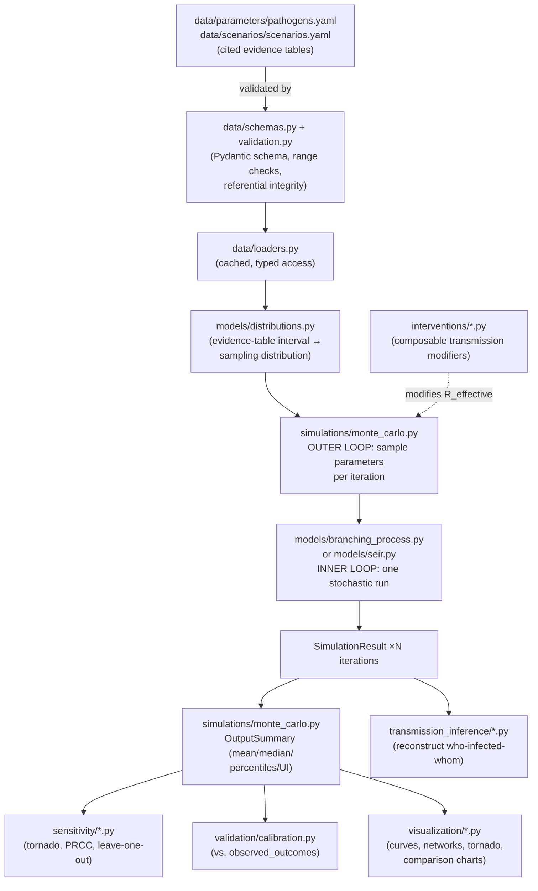

# Architecture Specification

## 1. Module map

The project brief specifies required top-level modules `/data /models
/simulations /interventions /validation /visualization /tests /docs`. This
project nests the code modules under a single installable package,
`src/outbreak_simulator/`, with `tests/`, `docs/`, `examples/`, and
`.github/` at the repository root (standard convention: pytest discovers
`tests/` at root, `docs/` at root is the universal documentation
convention, and GitHub Actions *requires* `.github/` at root).

**Explicit architectural decision:** the brief's flat module names
(`data`, `models`, etc.) are preserved exactly, but nested under
`outbreak_simulator/` rather than living at the repository root directly.
Rationale: bare top-level package names like `data` or `models` are
generic enough to risk import ambiguity/shadowing in a real Python
environment; nesting under one namespaced package is standard modern
practice (effectively a `src/`-layout) while still satisfying the brief's
structure literally — every required module name exists as a directory.

**Explicit architectural decision:** two modules beyond the brief's literal
list — `sensitivity/` and `transmission_inference/` — are given their own
top-level packages rather than being folded into `validation/`. Rationale:
requirement #7 (sensitivity analysis) and requirement #10 (transmission
inference) are each substantial, independently-testable subsystems with
their own dependencies (SciPy stats machinery; NetworkX) — folding them
into `validation/` would make that module a catch-all with poor cohesion.

```
src/outbreak_simulator/
├── data/                    # schemas, validation engine, loaders, YAML evidence tables
├── models/                  # distributions, branching process, stochastic SEIR
├── simulations/             # Monte Carlo engine, convergence diagnostics, scenario runner
├── interventions/           # vaccination, masking, ventilation, testing, isolation, ...
├── sensitivity/             # one-way (tornado), global (PRCC), leave-one-out, scenario robustness
├── validation/              # goodness-of-fit metrics, tiered calibration reporting
├── transmission_inference/  # epidemiological (timing-only) + TransPhylo (genomic) interface
└── visualization/           # epidemic curves, networks, comparison/sensitivity plots
tests/        (unit / integration / validation)
docs/         (this file, design doc, evidence tables, validation plan, ...)
examples/     (4 runnable end-to-end scripts)
.github/      (CI workflow, issue/PR templates)
```

## 2. Data flow



## 3. Why Gillespie SSA (not tau-leaping) for the SEIR model

Tau-leaping exists to approximate large-population stochastic systems where
exact SSA is too slow. This project's scenarios have populations in the
tens to low thousands (61 to 600 in the bundled scenarios) — small enough
that exact Gillespie SSA is computationally comfortable, so there is no
reason to accept tau-leaping's approximation error. **Decision:** implement
exact SSA; document tau-leaping as a roadmap item only if/when scenarios
with populations in the tens of thousands are added (see `docs/roadmap.md`).

## 4. Why a generic reaction-network engine for SEIR (not a hardcoded S/E/I/R loop)

Requirement #4B asks for "configurable compartments." Rather than writing
one hardcoded S→E→I→R loop and a second one for, say, S→E→I→Q→R,
`models/seir.py` implements a generic stochastic reaction-network simulator
(a list of `Reaction(rate_fn, delta)` objects) with `build_seir_reactions()`
as the default SEIR instantiation. Adding a quarantine compartment, an
asymptomatic split, or a hospitalized compartment is then a matter of
adding `Reaction` objects to `extra_reactions`, not writing a new simulation
loop. **Tradeoff accepted:** slightly more indirection than a hardcoded
loop, for genuine configurability rather than configurability-in-name-only.

## 5. Why a stochastic branching process AND a stochastic SEIR, but not also a full agent-based model

Requirement #4C explicitly allows an agent-based layer "only if justified"
and asks for tradeoffs to be explained if it is not built. This project's
judgment: **not justified for the current scope**, for three reasons:

1. **Redundancy with the branching process model for this project's actual
   use case.** The branching process model already represents individual-
   level transmission heterogeneity (the primary reason one reaches for an
   ABM over a compartmental model) via the negative-binomial offspring
   distribution. A full ABM would mostly buy back the *same* heterogeneity
   through a different, more expensive mechanism (explicit contact
   networks) without a scenario in this project that needs the additional
   structure (e.g. explicit spatial layout, heterogeneous individual
   susceptibility/behavior beyond what the offspring distribution
   captures).
2. **No available data to parameterize the additional structure.** An ABM
   earns its complexity when you have real contact-network or spatial data
   to feed it. None of this project's bundled scenarios have that (the
   Skagit choir seating chart is not published; barracks bunk assignments
   are not published) — building the machinery without the data to use it
   would be complexity without payoff.
3. **Cost.** A network-structured ABM is a substantially larger engineering
   and validation surface (network generation/calibration, per-agent state,
   typically 10-100x the runtime of the branching process model for
   comparable population sizes) for a benefit that, per points 1-2, is not
   currently realized.

**What would justify building it:** a scenario with real contact-network or
spatial data (e.g. an actual seating chart, a real dormitory floor plan
with room-level contact structure), or a research question specifically
about *network structure's* effect on outbreak risk (e.g. "how does
clustering coefficient affect superspreading risk, holding R0 and k fixed")
that the branching process model cannot represent by construction. Recorded
as a roadmap item, not built speculatively — see `docs/roadmap.md`.

## 6. Software engineering principles applied

- **Separation of data and code:** every quantitative claim lives in YAML,
  never hardcoded in Python (`data/parameters/pathogens.yaml`,
  `data/scenarios/scenarios.yaml`) — see `data/schemas.py` module docstring.
- **Fail loudly on bad data:** schema + referential-integrity validation
  runs before any simulation, and raises rather than silently proceeding
  with partially-invalid input (`data/validation.py`).
- **Single source of randomness control:** no module calls `np.random.*`
  directly or constructs its own `Generator`; every stochastic function
  takes an explicit `rng: np.random.Generator` parameter (enforced by
  convention and tested via reproducibility tests in every test file).
- **Pure functions where possible:** `validation/metrics.py`,
  `models/distributions.py` are stateless functions on arrays, independently
  testable without constructing a full scenario.
- **Composable interventions:** every intervention (pharmaceutical,
  environmental, behavioral) implements the same `Intervention` interface
  and combines via simple multiplication in `InterventionStack`, so adding
  a ninth intervention type requires no changes to the composition logic.
